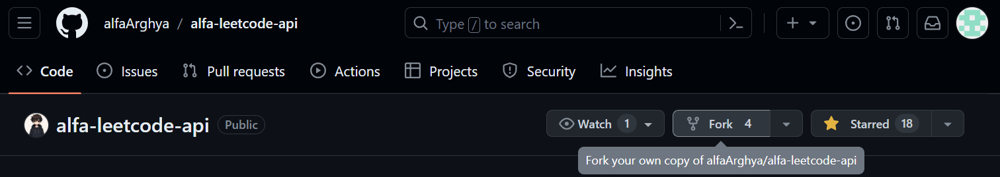

# Wanna Contribute 🤔??

## With Docker 🐳

- #### 🍴 Create a Fork of this Repo to Your GitHub Account

  

- #### 🧑🏽‍💻 Clone Your Repo Locally

  first open your CLI and clone the repo locally. But don't forget to replace **username** with your GitHub username

  ```bash
  git clone https://github.com/username/alfa-leetcode-api.git
  ```

- #### 👋🏽 Go to the Project Folder

  ```bash
  cd alfa-leetcode-api
  ```

- #### 🚀 Start the Project with Docker
  ```bash
  docker compose up
  ```

## Without Docker 🐳❌

- #### 🍴 Create a Fork of this repo to Your GitHub Account

  

- #### 🧑🏽‍💻 Clone Your Repo Locally

  first open your CLI and clone the repo locally. But don't forget to replace **username** with your GitHub username

  ```bash
  git clone https://github.com/username/alfa-leetcode-api.git
  ```

- #### 👋🏽 Go to the Project Folder

  ```bash
  cd alfa-leetcode-api
  ```

- #### 🚀 Install Required Modules

  ```bash
  npm install
  ```

- #### 🏃🏽‍♂️Run the Project Locally

  ```bash
  npm run dev
  ```

##

- #### 💡 Make Changes & Create Pull Requests

  Make changes as needed and push them to your GitHub repository with proper **commit message**. From there, create a **PR (Pull Request)** and submit it.

- #### 📌 Additional Tip

  Try to create a new branch relevant to your work. For example - `fix:xyz-issue`

  📝Note - It's not Necessary for contribution but it will help me to merge it.

#

#### 📌 Special Thanks to [@sazsu](https://github.com/sazsu) for improving the documentation
