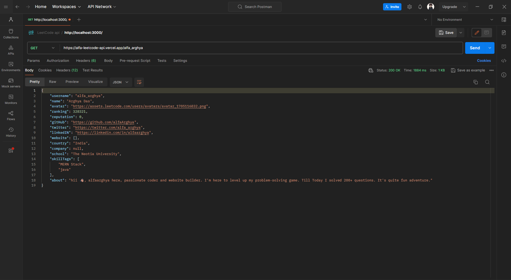

<h1 align="center">LeetCode Api</h1>
<div align="center">


</div>

## Tech Used 💻


## API URL 🌐

```
https://alfa-leetcode-api.vercel.app/
```

This API provides endpoints to retrieve details about a user's profile, badges, solved questions, contest details, contest history, submissions, and more.

## Endpoints 🚀

### 👤User Details

| Details              | Endpoint                             | Description                                                  | Demo                                                               |
| :------------------- | :----------------------------------- | :----------------------------------------------------------- | ------------------------------------------------------------------ |
| _Profile_            | `/:username`                         | Get details about a user's profile.                          |                                    |
| _Badges_             | `/:username/badges`                  | Get the badges earned by the user.                           | <a href="./public/demo/demo2.png" target="_blank">See the Demo</a> |
| _Solved_             | `/:username/solved`                  | Get the total number of questions solved by the user.        |
| _Contest_            | `/:username/contest`                 | Get details about the user's contest participation.          |
| _Contest History_    | `/:username/contest/history`         | Get contest history.                                         |
| _Submission_         | `/:username/submission`              | Get the last 20 submissions of the user.                     |
| _Limited Submission_ | `/:username/submission?limit=number` | Get a specified **_number_** of the user's last submissions. |
| _Calendar_           | `/:username/calendar`                | Get the user's submission calendar.                          |

### ❓Problem

| Details                     | Endpoint                                     | Description                                                                      |
| :-------------------------- | :------------------------------------------- | :------------------------------------------------------------------------------- |
| _Daily Problems_            | `/daily`                                     | Get the daily question.                                                          |
| _Selected Problem_          | `/select?titleSlug=selected-question`        | Get details about a **_selected-question_**.                                     |
| _Problems_                  | `/problems`                                  | Get a list of 20 problems.                                                       |
| _Limited Problems_          | `/problems?limit=number`                     | Get a list of a specified **_number_** of problems.                              |
| _Filter Problems_           | `/problems?tags=tag1+tag2`                   | Get a list of problems based on selected **_tags_**.                             |
| _Filter & Limited Problems_ | `/problems?tags=tag1+tag2+tag3&limit=number` | Get a list of a specified **_number_** of problems based on selected **_tags_**. |

## Connect Here

[](https://linkedin.com/in/alfaarghya)
[](https://twitter.com/alfa_arghya)
[](https://www.instagram.com/alfaarghya)
[](https://leetcode.com/alfa_arghya/)
